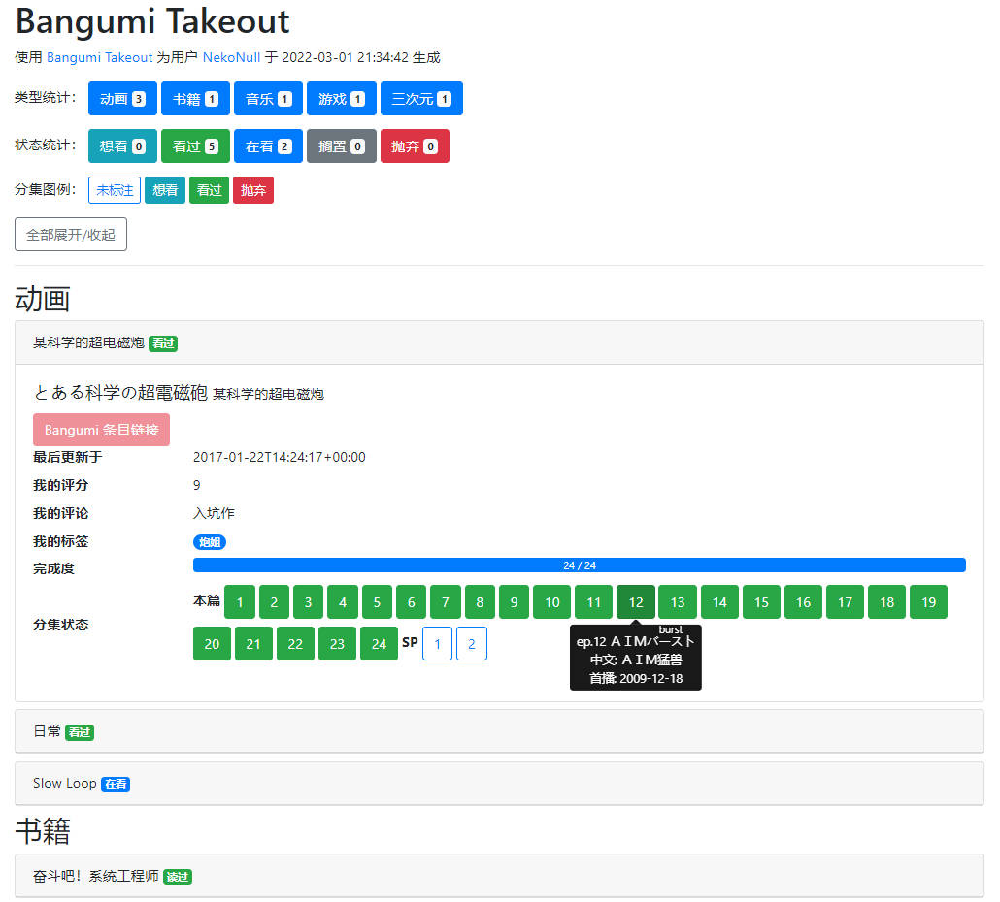

# Bangumi Takeout (More)

> [!CAUTION]
> 如果在 **2023/3/7** 前使用过 Bangumi Takeout More，请务必阅读 "历史版本的安全性问题" 一节。

|                                         | Bangumi Takeout                                              | Bangumi Takeout More                                         |
| --------------------------------------- | ------------------------------------------------------------ | ------------------------------------------------------------ |
| 🎉 直接使用 Colab 运行（无需本地部署！） |  |  |
| 导出内容                                | 标注记录（点格子）n                                          | - 讨论（我发表的、我回复的） - 日志 - 目录（我创建的、我收藏的） - 时间胶囊 - 收藏的人物（现实、虚拟） - 好友  |
| 导出机制                                | 基于 Bangumi API（稳定、官方支持）                           | 用 Cookies 和 UA 模拟用户请求（不稳定、慢）                  |
| 导出形式                                | HTML, CSV, JSON                                              | 默认仅导出 CSV 基础数据，选择「深度导出」会导出对应链接的 HTML 文件（不含图片） - 讨论：讨论页面 - 日志：日志页面 - 目录：目录页面 - 人物：人物页面 - 好友：好友的个人页面 |

---

（以下为主脚本 Bangumi Takeout 的介绍）

一系列简单的 Python 脚本，用于从 Bangumi 中导出自己的标注记录（aka 点格子），并转换为方便查看的 HTML 网页或 CSV 表格。

[导出后的 HTML 文件示例](http://nekonull.me/bangumi-takeout-py/)

## 文件简介
* `fetch.py`：使用 Bangumi API 导出自己的收藏记录，并保存到 `takeout.json`
* `generate_html.py`：读取 `takeout.json`，生成 HTML
* `generate_csv.py`：读取 `takeout.json`，生成 CSV
> `takeout.json` 中含有完整的 `subject`(条目) 和 `episode`(分集) 详情信息，此处只使用了一部分，如有需要也可以自行转换到其他格式。（欢迎 PR！）
* `mapping.py`：数据字典
* `utils.py`：用于生成结果的一些函数
* `auth.py`：完成 OAuth 认证，获得 API 的 Access Token

## 环境
需要 Python 3.6 或以上版本，并需要安装 `requests` 和 `tqdm` 两个依赖。

- 直接用 pip 安装依赖： `pip install -r requirements.txt`
- [PDM](https://pdm.fming.dev/) 用户可以使用 `pdm sync` 安装依赖。 

## 数据源
本脚本支持两种数据源：在线 [Bangumi API](https://bangumi.github.io/api/#/) 或 本地 [Bangumi Archive](https://github.com/bangumi/Archive)。

使用这两个数据源的差异如下：
- 本地源需要提前下载并解压到本地
- 在线源受到限流策略影响，导出速度会慢于本地源

用这两个数据源得到的结果大体上一致，但存在细微差异，具体如下：
- 完成度计算：在线源提供了精确的分母（主要分集数），但本地源没有，使用 `type` 为 `0` （本篇）的分集数量估算分母
- 分集类型：在线源中有 4 个分集类型（本篇、SP、OP、ED），本地源多出 2 个类型（预告/宣传/广告、其他）

如果账户中标注条目数较少（<=100），可以使用在线源，否则推荐使用本地源。

## 使用

### 在 Colab 上执行
🎉 现已支持直接用 Colab 运行：

### 在本地运行
1. （如果使用本地源）下载数据：从 [Archive Release](https://github.com/bangumi/Archive/releases/tag/archive) 下载最新的 `dump.zip`，将其中 `episode.jsonlines` 和 `subject.jsonlines` 两个文件解压到脚本所在目录下
2. 运行 `fetch.py`，在打开的认证页面中点击「允许」，正常执行完成后应得到 `takeout.json`
   
    > 如果出现认证异常可以稍后再试，似乎有概率会撞到 CloudFlare 盾，原因暂时未知。
    >
    > 如有可能，请将之前的 `takeout.json` 放置于同目录下，这样会使用增量方式更新收视进度，能极大提升导出速度。
3. 根据需要运行 `generate_html.py` 和 `generate_csv.py`，正常执行完成后生成的文件在脚本同目录下
   
    > `generate_XXX.py` 只使用 `takeout.json` 作为输入，如果已有 JSON，只需要从 JSON 转换成 HTML，则无需运行 `fetch.py`。

### 使用 Github Actions 执行
1. fork 本仓库到自己的名下
2. 打开新 fork 的项目主页，找到 Settings - Secrets and variables - Actions
3. 点击右侧 New repository secret， Secret Name 填入 `BANGUMI_ACCESS_TOKEN`，内容填入从[Bangumi OAuth Demo](https://api.bgm.tv/v0/oauth/redirect)获得的 token。（申请时请注意根据需要选择有效期）
4. （可选）如果需要自动定期执行，编辑 `.github/workflows/backup.yml`，解除第 6 和 7 行的注释。请尽量修改定时执行的时间，以避免多账户同时导出造成的服务器高负载影响其他用户。
5. 回到项目主页，找到 Actions - Backup Bangumi Data，点击右侧 Run workflow 运行。
6. 运行完成后，在 Actions - Backup Bangumi Data 右侧列表中点击某次运行，在 Summary - Artifact 中即可下载到本次的存档。

## 工作原理
先获取用户自身 uid/username，然后获取全部收藏，最后对每个条目逐个获取条目详情、条目内分集（如有）和个人标注进度。

## 已知限制
- （使用在线源）为了避免对 API Server 造成过大负载，目前在 `fetch.py` 中手动用 `LOAD_WAIT_MS` 变量，在每个请求前等待至少 200 ms。对于收藏量较多的账户，本脚本可能运行较长时间。（100 条目需要约 2min）

## 可能的下一步
> 欢迎 PR！
- [ ] 完全用前端实现（需要前端大触）
- [x] 支持筛选和搜索（感谢 @Tsuiokuyo 的贡献，见 [PR #20](https://github.com/jerrylususu/bangumi-takeout-py/pull/20) ）
- [x] 正确使用 Bangumi 的 OAuth 认证，而不是手动填 Access Token
- [x] 使用 [Bangumi/Archive](https://github.com/bangumi/Archive) 作为本地数据源
- [ ] 写个简单的 GUI 界面
- [ ] 点格子之外，支持日志和时间胶囊？（似乎没有 API）
- [ ] 整理输出层级，加 `--verbose`
- [ ] 裁剪用到的 CSS 和 Javascript 代码，构造一个完全 self-contained，无外部依赖的 HTML 文件
- [ ] 完成度异常（不存在总集数）时使用 `striped` 进度条样式？
- [ ] 未播出分集使用 `disbaled` 样式？

## Bug 回报

- 如有可能请尽量附上完整的 stack trace 和使用的 `takeout.json` 文件。如文件过大无法加入 issue 附件，可以先压缩，然后手动添加一个 `.txt` 后缀名。
- 启用日志：在 `fetch.py` 中将 `logging.basicConfig(level=logging.INFO)` 改为 `logging.basicConfig(level=logging.DEBUG)`

## 历史版本的安全性问题

如果你在 2023/3/7 之前使用过 Bangumi Takeout More，你可能已经安装了 Get Cookies.txt 插件。这一插件最近被发现为恶意插件。请尽快遵循以下指引以最小化损失：
1. 首先，卸载扩展；
2. 有些网站会显示已登录设备，并提供注销的选择，你可以在那个页面注销已登录设备；
    - Google: 管理您的 Google 账号 - 安全性 - 管理所有设备
    - Github: Settings - Assess - Sessions
    - Microsoft: 我的 Microsoft 账户 - 安全 - 登录活动
3. 最有效的防御手段是：浏览你的 cookie 列表，依次打开网站，主动点击注销按钮，网站会收到你的注销请求然后吊销该 cookie，保证开发者拥有无效数据；
4. 最后的最后，如果还不放心，请修改密码，部分网站在修改密码后会吊销所有 cookie。

[Bangumi 上的相关讨论](https://bgm.tv/group/topic/378915)

目前（2023/3/11），Bangumi Takeout More 已将 Cookie 导出方式由使用插件更换为用户手动在控制台执行指令，未来不会再出现类似的插件导致的安全问题。此后本项目在引入第三方依赖时会更加谨慎。也欢迎各位用户在发现安全问题时及时告知，创建 Issue、站内回帖或站内信均可，我会尽快处理。

（Bangumi Takeout 使用 Bangumi API 实现，不受此次事件的影响。）